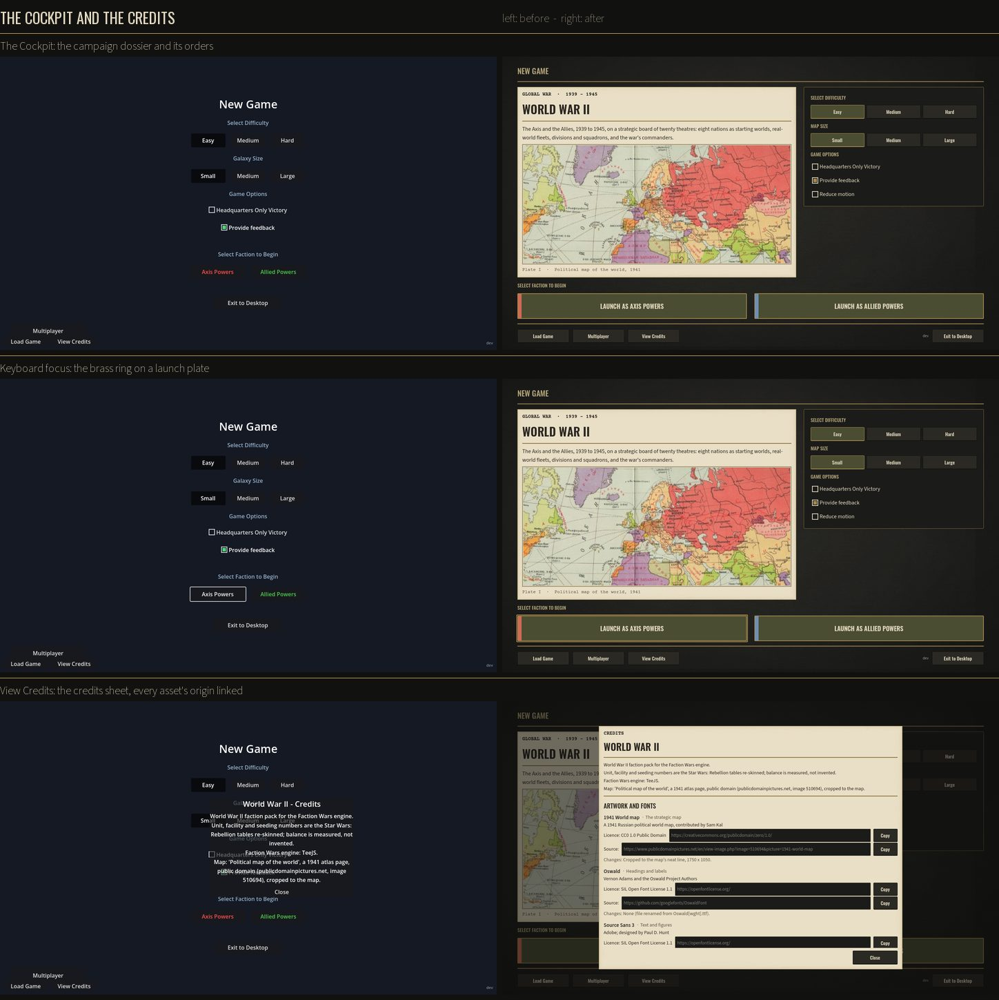
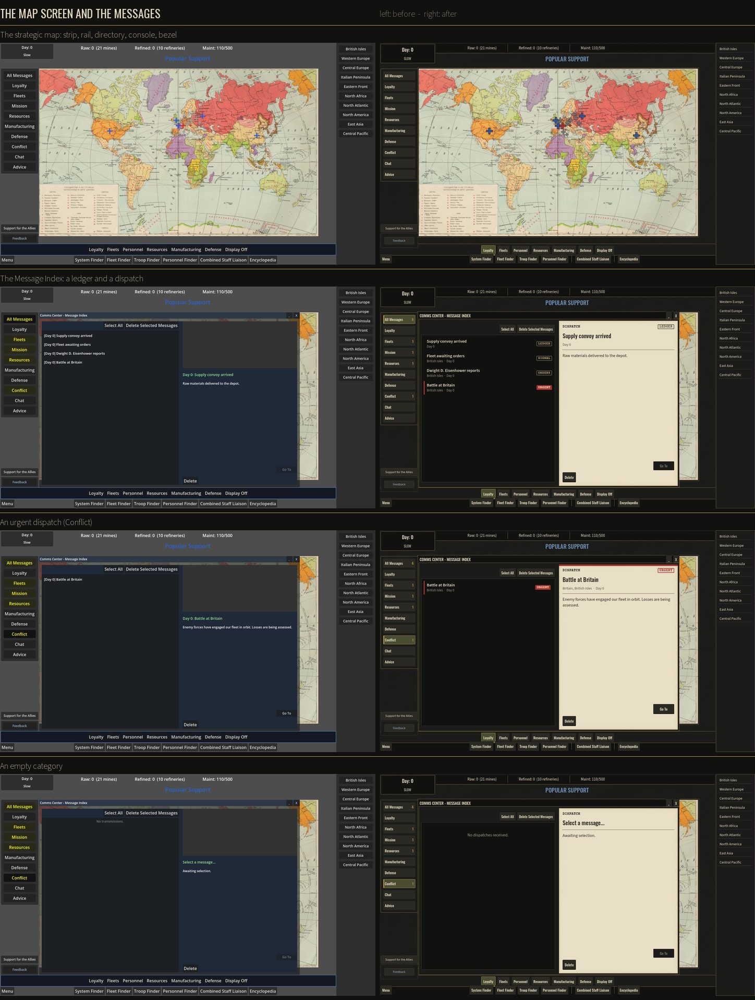
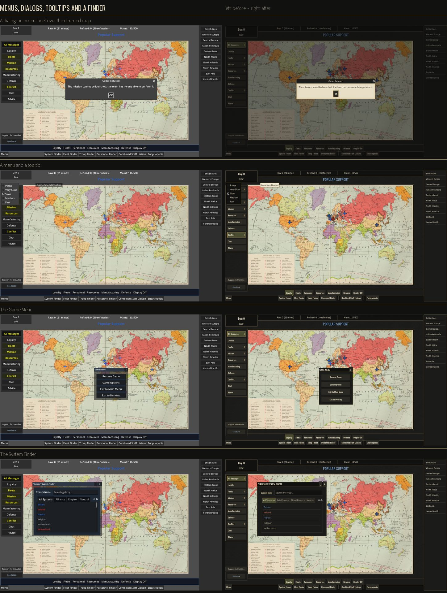
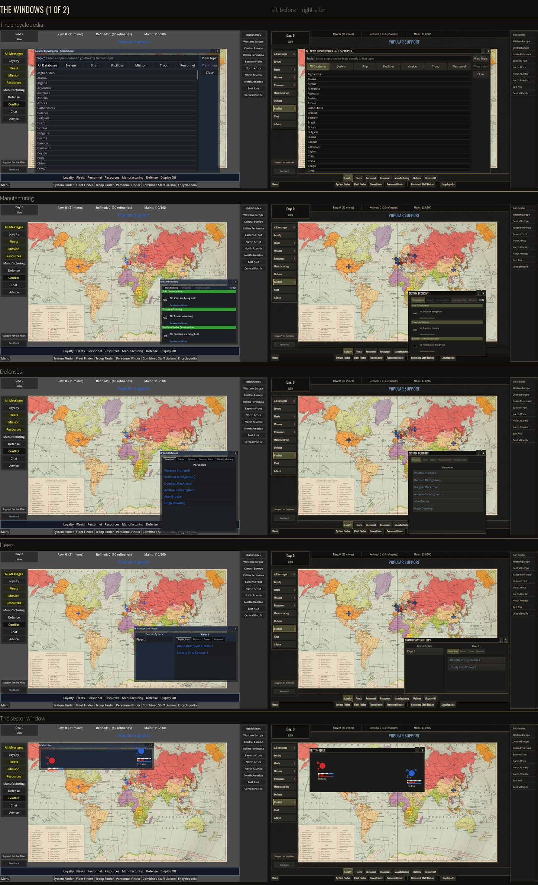
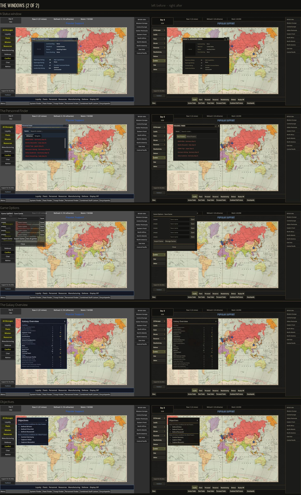
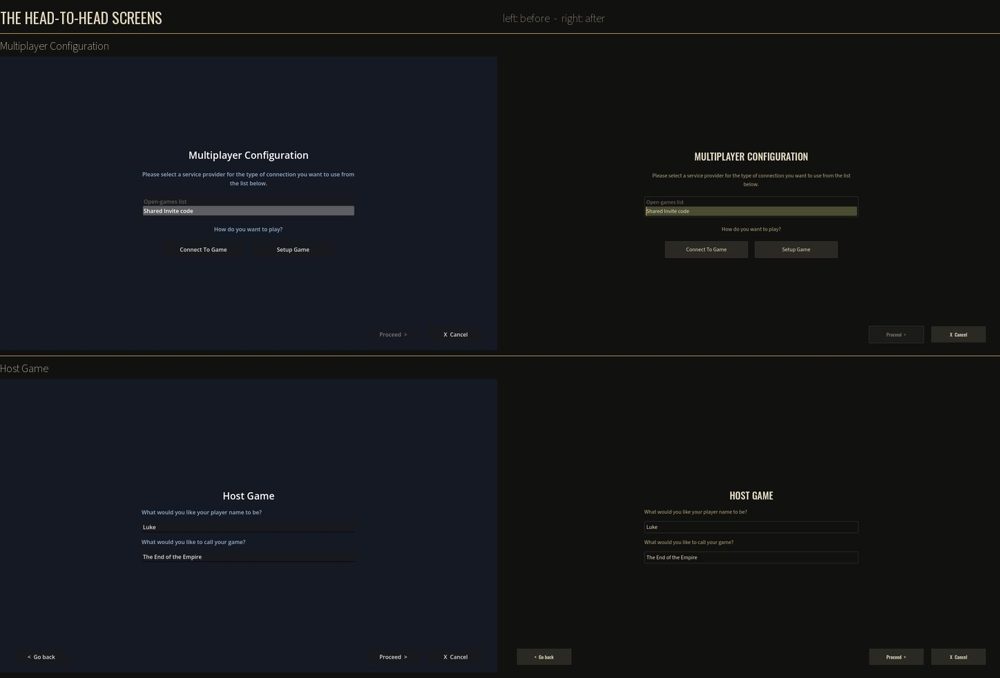
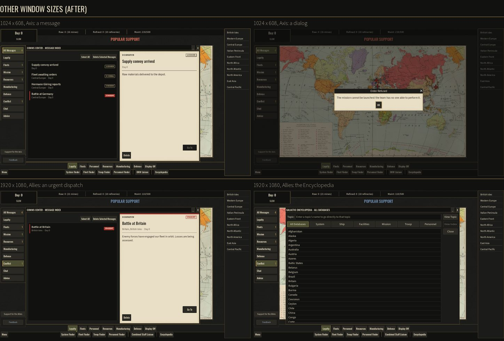
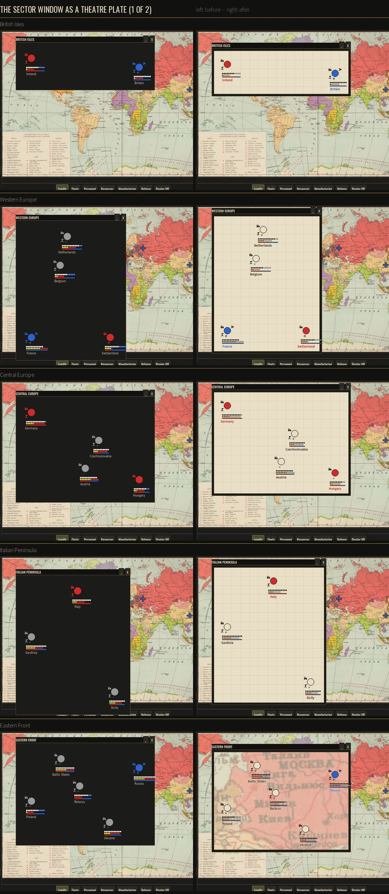
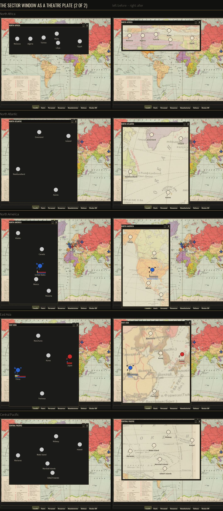

# The WWII look: primitives and rationale

The WWII pack's 1940s strategic-command look. It is a map room, an operations
desk, field orders and dispatches: charcoal steel, brass trim, parchment and ink,
khaki and olive, with Allied blue and signal red used sparingly. The plan and
TeeJ's sign-off are in [ww2-look-plan.md](ww2-look-plan.md). This page records
what was built, the pieces it is built from, and why. The before/after sheets
are at the end.

| Phase | What | PR |
|---|---|---|
| 0-3 | Baseline captures; the system; the Cockpit and the credits sheet; the map screen's shell | #375 |
| 4-6 | Messages as dispatches; menus, dialogs, tooltips; every other window; the look on the whole tree | #393 |
| 7 | This write-up and the before/after sheets | #397 |
| 8 | The sector window as a theatre plate, and the detail map it needs | this PR |

Related, not look work: the finders' side names (#394) and the sector window's
names kept inside it (#395, #396).

## One system, keyed off one file

- **`packs/<id>/look.json`** holds the tokens. It is documented in SCHEMA.md
  section 15 and checked by validation rule 31. It is **not** in `PACK_FILES`,
  so it never touches a pack's content hash, a save or the simulation.
- **[src/ui/look.gd](../src/ui/look.gd)** (`Look`) builds **one** Godot Theme
  from those tokens: the base controls, plus one type variation per piece.
  It is the only place a look's colour is decided.
- **A pack without `look.json` gets nothing.** `Look.Active()` is false, so no
  theme is set and no hook does anything. Every scene keeps the colours it was
  drawn with. The Star Wars pack is therefore pixel-identical before and after
  every phase; `tests/capture_look.gd` proves it (below).
- **Nothing checks the pack's name.** Every switch is `Look.Active()`, so any
  pack that ships a `look.json` gets the same treatment.

## The primitives

Each piece is a theme type variation (`Look.PIECES`). A node is tagged with a
piece by setting its `theme_type_variation`. With a look active it wears the
piece; without one the tag does nothing.

| Piece | Variation | What it is | Built from |
|---|---|---|---|
| Panel | `LookPanel` | a window body, flush so its title bar meets the frame | chassis, brass_dim edge |
| Inset | `LookInset` | a recessed well: a list, a readout | chassis_deep, edge |
| Title bar | `LookTitleBar` | a window's bar | chassis_deep, a brass_dim hairline under it |
| Title | `LookTitle` | the bar's words | display face, title size, text |
| Command | `LookCommand` | a console key, a dialog's action, a window's close and minimise | chassis_raised; hover brass_dim; held down olive_deep with a brass edge |
| Rail | `LookRail` | one drawer of a category rail (the message categories) | the selected one olive_deep, notched with a 4 px brass edge |
| Row | `LookRow` | a list row: a ruled ledger line | a hairline under it; picked olive_deep with a brass edge |
| Heading | `LookHeading` | a section label | display face, heading size, khaki |
| Divider | `LookDivider` | the brass rule | the `rule` texture |
| Chip / Chip alert | `LookChip`, `LookChipAlert` | the day and speed, counts; its urgent state | chassis_deep; signal |
| Document | `LookDocument` | parchment: dispatches, the dossier, the credits sheet | the `paper_frame` nine-slice (texture at the edges, flat under the words) |
| Ink / Typed | `LookInk`, `LookTyped` | words on a document; a typed heading | ink; Courier Prime Bold |
| Modal | `LookModal` | a dialog's frame | chassis, brass_dim edge |
| Launch | `LookLaunch` | the Cockpit's launch plates | olive_deep, brass edge, display bold |

The base controls get the same family. Buttons are keys. A check box is bare,
with its box as its icon. Menus are an instrument panel: chassis_deep, a brass
edge, and the row under the pointer in olive. A tooltip is a field note: `note`
paper with `note_ink`. Tabs have a brass top edge on the open one. Scroll
grabbers are brass. A text field is chassis_deep and turns brass on focus.

**The focus ring** (`Look.FocusRing`) is a brass line standing 3 px clear of the
control. That way it reads as "keyboard here", never as the control's own
pressed edge. The first version sat on the edge and looked like a held-down key
(phase 2).

## The tokens (the WWII pack's)

| Token | Colour | Role |
|---|---|---|
| `chassis` / `chassis_deep` / `chassis_raised` / `chassis_hover` | `#1b1b19` / `#111110` / `#2a2923` / `#34322a` | the frame, wells, keys, a key under the pointer |
| `edge` | `#3d3a30` | a panel's quiet border |
| `brass` / `brass_dim` | `#a88a4e` / `#7d6a3f` | trim, dividers, the selected edge, the focus ring |
| `text` / `text_muted` / `text_disabled` | `#e6dcc3` / `#a59d88` / `#7a7463` | words on the chassis |
| `heading` / `khaki` | `#b5a67a` | section labels, status |
| `olive` / `olive_deep` | `#6b6f45` / `#4a4d31` | the selected fill, structure |
| `paper` / `paper_edge` | `#e9dfc6` / `#d8c9a3` | documents |
| `ink` / `ink_muted` | `#2a2620` / `#5a5244` | words on paper |
| `signal` / `signal_text` | `#a8322a` / `#f1e6cf` | urgent, losses, a paused clock; a band or a fill, not small words on the chassis |
| `note` / `note_ink` | `#efe6cf` / `#2a2620` | tooltips |
| `overlay` (alpha 0.55) | `#0b0b0a` | the dim behind a modal dialog |
| `sides` | Allies `#6f8fb5`, Axis `#d06a55` | a side in the chrome. They were lightened from `#4a6a8f` and signal red in phase 3, because they are also text and needed 4.5:1 on the chassis. **The map keeps `factions.json`'s colours.** |

**Type** (all SIL OFL 1.1):

| Face | Role | Why |
|---|---|---|
| Oswald (variable, 500 / 600) | display: headings, titles, keys | a reworking of the condensed "Alternate Gothic" faces of period newspapers and signage |
| Source Sans 3 (variable, 400 / 600, tabular figures) | body: words and figures | humanist and very legible; tabular figures keep columns of numbers aligned |
| Courier Prime (regular / bold) | typed headings on documents only | evokes the typewriter. Courier itself dates from 1956, so this is an evocation, not a period claim |

**Sizes:** body 16 (the engine's default, so layouts sized for it hold), small
13, label 14, title 15, heading 18, display 34. **Metrics:** corner radius 2,
border 1, focus 2, padding 8.

**Textures** (`paper`, `paper_frame`, `desk`, `grain`, `rule`) are generated
from seeded noise by
[tools/look/make_ww2_textures.py](../tools/look/make_ww2_textures.py) (seed
1941). They are original work and reproducible. The grain is kept faint: it was
halved in phase 1 after the first captures.

**The detail map** (`map_detail`, phase 8) is the strategic map's own 1941 atlas
scan again, 4096 x 2458 against the strategic map's 1750 x 1050, lined up
with `world_1941.jpg` to half a pixel. The sector windows' plates are cut from it.
Its source, hashes and every step are in
[packs/ww2/look/MAP-DETAIL.md](../packs/ww2/look/MAP-DETAIL.md), and
[tools/look/make_ww2_map_detail.py](../tools/look/make_ww2_map_detail.py)
rebuilds it byte for byte.

## How each screen gets the look

| Surface | Where | Treatment |
|---|---|---|
| The Cockpit | [cockpit_dossier.gd](../src/ui/cockpit_dossier.gd) | Menu.tscn's own buttons, re-parented into the campaign dossier (title, "1939 – 1945", summary, a map plate) and an orders panel. Two launch plates, each one click. The desk under it, with a slow light drift that stops under Reduce motion. |
| The credits sheet | [credits_window.gd](../src/ui/credits_window.gd) | A document: the pack's lines, then every picture and font with its author, licence and source. Links open a tab on the web; on the desktop they show the address and a Copy button. |
| The map screen's shell | [look_hud.gd](../src/ui/look_hud.gd), [galaxy_map.gd](../src/ui/galaxy_map.gd), [gid_bar.gd](../src/ui/gid_bar.gd) | The operations strip (readouts between brass rules), the dispatch rail (unread mail as a brass count, not a glow), the theatre directory (an open theatre reads as selected), the console of grouped keys (the mode on show held down), and the bezel. Markers get an ink rim so they hold on the paper map. |
| Messages | [look_dispatch.gd](../src/ui/look_dispatch.gd) | See below. |
| The sector window | [look_sector.gd](../src/ui/look_sector.gd) | See below. |
| Menus, dialogs, tooltips | `Look.InstallPopups` | See below. |
| Every other window | [look_window.gd](../src/ui/look_window.gd) `Install` | See below. |
| Everything else | `Look.Install` | The theme on the whole tree, once every window is dressed. |

**Messages as dispatches (phase 4).**
- The list is a ruled ledger. Each row shows the subject (bold until read), the
  theatre and day, and the category's stamp from `look.json` `messages`: ORDERS,
  SIGNAL, LEDGER, INTELLIGENCE, OPERATIONS, URGENT, CABLE, ADVISORY.
- The message being read is a parchment dispatch, in reading order: subject,
  then where and when, then the text in ink, then the actions as keys.
- Conflict carries a signal band on its row and across its dispatch. Nothing
  flashes.
- The parchment is **drawn under** the detail column, not wrapped round it.
  `message_window.gd` finds the picture by a fixed node path, and that path
  must keep resolving.

**The sector window as a theatre plate (phase 8; TeeJ: "the sector view still
looks like SWR").** The window keeps every element the manual gives it
(manual p025-p026, Figs 2.8 and 2.9), where it was, answering as it did.
One pass at the end of each repaint (`LookSector.Dress`) changes only how each
is drawn:

| Element | Drawn as |
|---|---|
| The ground | the theatre cut from the detail map under a parchment wash, each system over its own place; or a plain plotting sheet (below) |
| A system | its holder's map colour with an ink rim; an unheld one an ink ring; the HQ ring brass |
| Its name | Source Sans 3 semibold, in its holder's colour darkened to 4.5:1 on parchment (ink when unheld), with a paper halo |
| The corner icons | the same glyphs in ink on paper tabs; an uprising's in signal red |
| Energy, raw materials | ink and olive squares, open when free, all ink-edged |
| Loyalty bar, GID star | the sides' map colours with an ink edge; the map's cross with an ink rim |

**The map or the sheet.** The window spreads a theatre's systems to fill it,
so the map must be magnified to match. That works where it stays sharp. The
four small European theatres need 5.1-7.0 times the detail map's pixels, and
at that zoom the map is too soft to read, so they get a plain plotting sheet
(parchment, a faint grid). The other six need at most 2.8 times and stay
maps. The cut-off (`SHARP_ZOOM`, 4) sits in the middle of that gap.

Two forms were tried and rejected (TeeJ, 2026-09-29):
- a sharp map wider than the layout, which put systems on the wrong places;
- the lined-up map from the strategic map's own picture, which was a blur.

**Menus, dialogs, tooltips (phase 5).** The game makes these in some forty
places. So `Look.InstallPopups` dresses them from one `node_added` hook on the
tree rather than at each call site:
- A popup menu gets the theme.
- A dialog gets `Look.SheetTheme()`: the theme with a parchment body and its
  words in ink. Its OK and Cancel become command keys.
- A tooltip panel gets the field-note style.
- A modal dialog gets a dim on a layer above the briefing and below every
  embedded window. The dim takes no clicks, so nothing a dialog allowed before
  is blocked.

**Every other window (phase 6).** `LookWindow.Install` is the same kind of hook,
for every window class and the four head-to-head screens. A window that has
the scene template's parts (`TitleBar`, `ContentArea`) gets the steel frame.
Every window then has its **plain palette traded for the look's**:

| Plain colour | Becomes |
|---|---|
| title bar navy `(0.18, 0.22, 0.28)` | chassis_deep |
| body navy `(0.12, 0.16, 0.22)` | chassis |
| well navy `(0.08, 0.10, 0.14)`, the code-built windows' `(0.06, 0.08, 0.13)` | chassis_deep |
| steel-blue headings `(0.6, 0.7, 0.8)`, the green highlight `(0.6, 0.9, 0.6)` | heading |
| greys for read, empty or not yet usable | text_muted |
| white and light grey | text |
| a playable side's map colour, as text | that side's look colour |
| the code-built windows' blue edges | brass_dim |

The tables are `BG_MAP`, `EDGE_MAP` and `TEXT_MAP`, each matched on RGB within
0.015 with alpha kept. Rows a window adds later (a repaint) are re-coloured as
they arrive. **Colours with a meaning are left as drawn**: damage red, ready
green, gold, cyan. Every plain colour was chosen for a dark ground, and the
chassis is dark too.

Why a palette trade and not scene edits: the plain windows share one small
palette across some twenty scenes and scripts. One table dresses them all, and
it keeps dressing whatever those scripts build later.

**Adopt.** A tagged node wears its piece: `Look.Adopt` strips the colours,
styles and faces a scene gave it, and keeps its sizes. A node whose colours are
the look's own marks itself `Look.OWN_COLOURS`, and Adopt leaves it alone. The
finder's side-coloured rows do this.

**The look on the whole tree.** The Cockpit (`menu.gd`) and the game screen
(`game_manager.gd`) call `Look.Install`. It sets the theme for a pack with a
look and takes it off for one without, so switching packs never leaves the last
pack's look on. The pack_switch pair checks this.

## Accessibility

- **Contrast.** `Look.CONTRAST_PAIRS` names every text-on-surface pair, and
  `tests/look_system.gd` fails a look below WCAG 4.5:1 for text or 3:1 for
  edges and disabled text. It also checks each side colour on the chassis.
  One known exception is taken knowingly: the red band on the dark ledger is
  2.84:1. It is a second cue; the URGENT stamp beside it (5.38:1) carries the
  meaning.
- **Keyboard.** Every key, row and plate takes focus and shows the brass ring.
- **Motion.** The only motion is the Cockpit's light drift. It stops for the
  browser's `prefers-reduced-motion` and for the Cockpit's Reduce motion box
  (remembered along with Provide feedback). Nothing flashes.
- **Sizes.** The body stays at 16. The captures at 1024 x 608, 1440 x 850 and
  1920 x 1080 show no clipped text.

## Origins and attribution

- **Every shipped picture and font names its origin.** Pack assets are in
  `packs/<id>/credits.json` and engine assets in `assets/credits.json`, both
  documented in SCHEMA section 16. `tests/asset_credits.gd` fails on any
  shipped image or font without an entry.
- **The Cockpit shows these credits.** View Credits opens the credits sheet
  with each asset's links.

| Asset | Origin |
|---|---|
| 1941 world map | CC0; Sam Kal via publicdomainpictures.net (image 510694); cropped to the map |
| Its detail copy (phase 8) | the same 1941 Soviet school-atlas page (GUGK, *Политическая карта мира*, pp. 42-43) from Wikimedia Commons, marked Public Domain there; lined up and reduced by `tools/look/make_ww2_map_detail.py`. Source, hashes and the licence text: [MAP-DETAIL.md](../packs/ww2/look/MAP-DETAIL.md). ⚠ Commons gives no separate US public-domain tag for it, and the same holds for the 1941 map above. |
| Oswald, Source Sans 3, Courier Prime | SIL OFL 1.1, from the projects' own GitHub repositories. Commits, sizes and SHA-256 are in [packs/ww2/look/fonts/README.md](../packs/ww2/look/fonts/README.md), with each licence alongside. |
| Paper, desk, grain, rule | original, generated by `tools/look/make_ww2_textures.py` |
| The brand art | commissioned for Faction Wars from a local artist; attribution not required |

There are no photographs, insignia or propaganda. The sides are marked
typographically.

## Decisions taken along the way

| Decision | When |
|---|---|
| A pack without a look gets **no theme at all**, rather than a theme matching today's colours. The result is the same, with a stronger guarantee: nothing is re-created, so nothing can drift. | phase 1 |
| Reduce motion sits in the Cockpit's own Game Options group, beside the light it stills. | phase 2 |
| The side colours were lightened for text contrast. | phase 3 |
| A message's picture box shows only when the message has a picture. A small typed DISPATCH line and the stamp sit above the subject, which is still the first large line. | phase 4 |
| Menus, dialogs and windows are dressed from hooks on the tree, not per call site. | phases 5-6 |
| The multiplayer screens are dressed too (TeeJ, 2026-09-29). | phase 6 |
| The opening briefing is not dressed: it cannot play in a WWII game. It needs the pack's briefing recordings and the original frame's agent droid, and the pack has neither. | phase 6 |
| The sector window becomes a theatre plate, keeping every element and position (TeeJ chose option A, 2026-09-29). | phase 8 |
| A sharper copy of the same atlas scan was found and lined up, and its origin recorded (TeeJ, 2026-09-29). | phase 8 |
| Where even that would blur (above 4 times), the plain plotting sheet is used, automatically (TeeJ chose (b), 2026-09-29). | phase 8 |

## Checking it

| Test | What it checks |
|---|---|
| `tests/look_system.gd` | the theme, the pieces, every contrast pair and side colour; a pack without a look gets nothing |
| `tests/cockpit_dossier.gd` | the Cockpit's dossier, plates, focus and Reduce motion |
| `tests/look_hud.gd` | the map screen's shell |
| `tests/look_messages.gd` | the dispatches: rows, stamps, band, reading order, the empty words, the picture's path |
| `tests/look_popups.gd` | menus (including one made before the hook), the order sheet, the dim, tooltips, the System Finder, the Game Menu |
| `tests/look_windows.gd` | twelve windows and two head-to-head screens: each wears the look, and **none of the plain palette is left**, even after a repaint. On Star Wars it finds the plain palette in the undressed windows, which shows the search works. |
| `tests/look_sector.gd` | every theatre's sector window: the map or the sheet by its zoom, the layers under every entry taking no clicks, the plate cut from the detail map, every system's mark and name, each icon and bar in the look, no Star Wars colour left |
| `tests/asset_credits.gd` | every shipped picture and font is credited |
| `tests/pack_validation.gd` | rule 31's cases, `messages` and `map_detail` included |
| `tests/capture_look.gd` | the captures, below |
| `tests/capture_look_sectors.gd` | a shot of every theatre's sector window; `--sheet` puts all on the plain sheet; `--pair=Name@x:y,...` opens several at once where they are dragged |

Every test that starts a game runs once per pack: `--pack=ww2` and
`--pack=star-wars-rebellion`, with `--seed=12345`.

**Captures.** `tests/capture_look.gd` needs a window, not `--headless`:

```
Godot_console.exe --path . --resolution 1440x850 -s tests/capture_look.gd -- --out=<folder>/ww2_allies --pack=ww2 --faction=allies --seed=12345 --record=user://capture-look.jsonl
```

It writes 23 shots, from the Cockpit through every window to the head-to-head
screens, and they are pixel-deterministic. With the Star Wars pack every shot
was compared with the one before each phase: all pixel-identical. The one
exception is the sector shot, whose directory pin catches the open-window poll
at a different moment from run to run.

## Giving another pack a look

1. Add `packs/<id>/look.json`. SCHEMA section 15 lists the tokens, and all 23
   colours are required. Validation rule 31 names anything wrong.
2. Ship its fonts and textures in the pack. Credit every one in
   `packs/<id>/credits.json`; `tests/asset_credits.gd` fails on any that isn't.
3. Run `tests/look_system.gd --pack=<id>`: it fails any pair below its contrast.
4. Capture it with `tests/capture_look.gd` and look at every shot.

No code names a pack: everything follows from the file.

## Before and after

The WWII pack on main before the look (d73a5b6), left, and after it (221f872),
right, at 1440 x 850, playing the Allies.









Phase 8, every theatre's sector window, before (left) and after (right):



